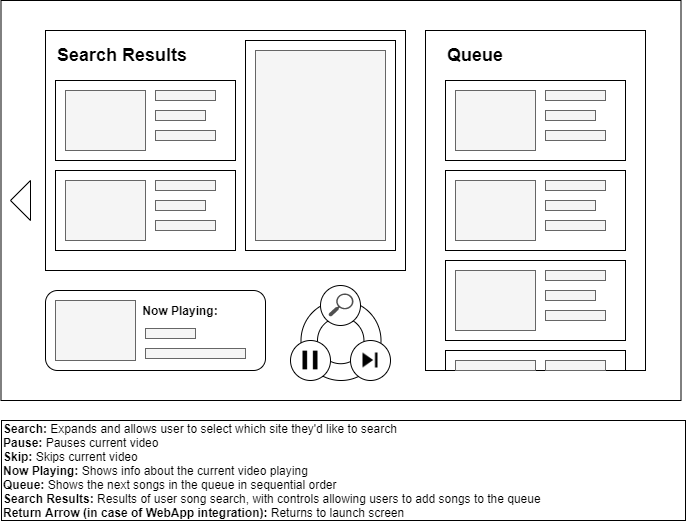

## Multi Music Player Requirements

### Framework: React.js
### Developmental Model: Waterfall
### Developer: Erik Halenkamp

#### High Priority Requirements

- Search music from either YouTube or Spotify and add the song to a queue
- Download and play songs from the queue
- Allow users to skip the currently playing song, or remove other songs from the queue
- Music must auto-play from one song to the next
- Be able to play/pause music

#### Low Priority Requirements

- Compatability with other music services, such as Soundcloud
- Save and load playlists
    - Requires account system(?)
- 'Play Now' functionality that allows the user to supercede the queue

#### User Stories

- As a user, I must be able to search and add music easily via the app's own interface
    - Requires API connections to YouTube, Spotify, and other music sharing services
    - Requires package for download/player management
- As a user, I must be able to manage the queue easily
    - Queue should be relatively easy to manage using React's state
- As a user, I should be able to pause and replay music easily
    - Requires a song stay loaded while in stasis

#### Wireframe (Based on User Stories)

#### Components List (Based on Wireframe)

(* = Requires Internal State)
- Derived From App
    - Search Field*
    - Play/Pause Button
    - Skip Song Button
    - Search Results
    - Queue
    - Now Playing
- Extra Components
    - VideoTile
    - VideoResult
    